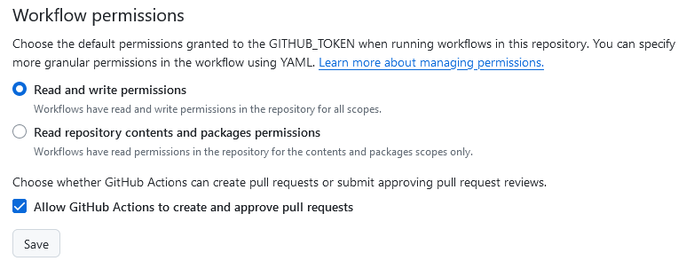

# Maintain Rust Action

A simple GitHub Action that performs regular _crate maintenance_,
which means it runs a `cargo update`, applies auto-fixable `cargo clippy` followed
by a `cargo fmt`.

## Example

You can start by copy-pasting this snippet to a `.github/workflows/crate-maintenance.yml`,
making sure that you _pin_ this action repository.

```yaml
name: Crate maintenance

on:
  schedule:
    - cron: "14 3 * * 5" # every friday at 03:14
  # workflow_dispatch: # optionally, if desired

jobs:
  rust-maintain:
    runs-on: ubuntu-latest

    permissions: # see below for permissions / security
      contents: write
      pull-requests: write

    steps:
      - uses: Swatinem/rust-maintain@master # you should use a *pinned commit*
```

After running, the action will open a pull request with crate updates and `clippy` auto-fixes,
like [this one](https://github.com/Swatinem/rust-maintain/pull/1).

## Permissions / Security

As you can see in the example above, this action requires elevated permissions
in order to push code changes, and to open / update pull requests.

Apart from granting those permissions in a workflow file, you also have to grant
extra permission for this action to be able to open / update pull requests.

You can find these in the GitHub Settings UI under _Settings > Actions > General_, as seen here:



---

Similar to other dependencies, you should follow best practices when it comes to
_software supply chain security_. This means that you should not blindly trust me.
I encourage you to _review_ the code of this action thoroughly, and to **pin** an
exact commit when using it.

As the primary use-case of this action is to run `cargo update`, the same also
applies to pull-requests opened by this action:

You should not blindly trust the dependency updates in the `Cargo.lock`,
but _review_ the changes before merging any pull-request.

## Known Limitations

- The action assumes a Cargo workspace in the root of the repository, it will thus
  not work with nested workspaces.
- The `cargo clippy` portion currently runs with the default features, it might thus
  miss code that is behind a feature flag.
- Clippy auto-fixes can sometimes lead to broken code, so make sure to review the proposed changes.

## FAQ

**Isn’t this the same as `dependabot` or `renovate`?**

The `cargo update` portion might be similar, but this action also applies `clippy` auto-fixes.
Apart from this, I am not a fan of [`dependabot`](https://docs.github.com/en/code-security/getting-started/dependabot-quickstart-guide) myself,
as it is often overly spammy and opens an unreasonable amount of PRs.
[`renovate`](https://docs.renovatebot.com/) can be configured to batch multiple updates,
but configuring it properly is quite some effort.

In general I would still recommend to use either tool to automatically open PRs
for major version updates, or to regularly review dependencies.

## Credits

This action is heavily based on the Rust compilers own
[dependency update workflow](https://github.com/rust-lang/rust/blob/a526d7ce45fd2284e0e7c7556ccba2425b9d25e5/.github/workflows/dependencies.yml).
The primary credit thus goes to its [original author](https://github.com/rust-lang/rust/pull/110805),
[@pitaj](https://github.com/pitaj)
